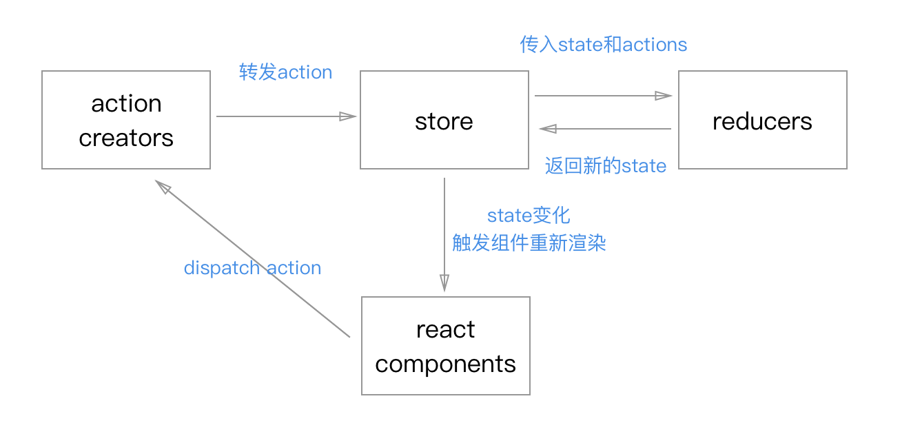

## 深入理解并实现redux与react-redux

`Redux `是 `JavaScript` 状态容器，提供可预测化的状态管理。`redux`中所有的 `state` 都以一个对象树的形式储存在一个单一的 `store` 中。 惟一改变 `state `的办法是触发 `action`，一个描述发生什么的对象。 为了描述 `action` 如何改变 `state` 树，你需要编写 `reducers`。
但是在react中使用还需要配合`react-redux`，才能把`state`的数据通过`connet`函数把`react`组件链接起来，才能发挥作用。本文章就把这些知识点一一揭开然后深入理解`redex`，最后的目的是让我们写`redux`更加得心应手。

## 1、redux介绍

我们有下面以一张图来看一下`redux`的工作流程是怎么样子的。



下面我们简单简介一下上图的节点是只有什么作用

### 1.1、store

`store`就是保存数据的地方，你可以把它当作一个存储数据的仓库，整个应用只有一个数据仓库。

````js
import { createStore } from 'redux'
const store = createStore(reducer)
````

### 1.2、action

用户只不能直接接触到`store`，只能通过`action`来改变`store`里面的`state`数据

````js
const action = {
  type: 'INCREMENT',
  payload: 1
}
````

### 1.2、Action Creator

便捷生产`actions`，避免每个地方用到，然后到处都是手写的代码。

````js
const INCREMENT = 'INCREMENT'
function add(num) {
  return {
    type: INCREMENT,
    num
  }
}

const action = add(1)
````

### 1.3、dispatch

用户通过`dispatch`来发出`actions`，由`reducer`接收到

````js
store.dispatch(add(1))
````

### 1.4、Reducer

接收到`reducer`接收到`action`，通过计算生产新的`state`，然后改变`store`中的`state`，然后触发订阅的函数来触发组件的更新

````js
function reducer(state, action){
  return state
}
````

## 编写redux

````js

function createStore(reducer, preloadState = {}, enhancer) {
  // 增强仓库的能力以使用第三方的能力比如中间件  
  if (enhancer) {
    return enhancer(createStore)(reducer, preloadState)
  }

  let state = preloadState
  let listeners = []

  function getState () {
    return state
  }
  // 订阅函数
  function subcribt (fn) {
    listeners.push(fn)
    return () => {
      let index = listeners.findIndex(fn)
      listeners.splice(index, 1)
    }
  }
  function dispatch (actions) {
    state = reducer(state, actions)
    listeners.forEach(fn => fn())
  }
  //派发了一个动作获取初始值，其实在redux内部是派发一个INIT: '@@redux/INIT'动作
  dispatch({ type: '@@redux/INIT' })
  return {
    getState,
    subcribt,
    dispatch
  }
}

````

看上面的`redux`实现代码，代码量很少，整个流程就是：

- `getState`就是回去最新的`state`；
- `subcribt`就是订阅一个函数，把它推到`listener`s`数组中，并且返回一个可以删除订阅的函数；
- `dispatch`接收到外面的`actions`之后通过`reducer`的处理，返回值赋值`state`，最后就运行订阅的函数。

下面我们看看在`html`中怎么使用

````html

<body>
  <h2 id="val"></h2>
  <button id="add">+</button>
  <button id="dec">-</button>
  <button id="asyncAdd">异步+</button>
  <script src="./redux.js"></script>
  <script>
    const $ = id => document.querySelector('#' + id)
    const val = $('val')
    const add = $('add')
    const dec = $('dec')
    const asyncAdd = $('asyncAdd')
    // 编写reducer
    function reducer (state, actions) {
      let res = state
      switch(actions.type) {
        case 'add':
          res = state + 1
          break
        case 'dec':
          res = state - 1
          break
        default:
         res = state
      }
      return res
    }
    // 创建store
    let store = createStore(reducer, 0)

    function render () {
      val.innerHTML = store.getState()
    }
    // 订阅render函数
    store.subscribt(render)
    // 先执行一次render
    render()
    
    add.onclick = e => {
      // 触发add
      store.dispatch({type: 'add'})
    }
    dec.onclick = e => {
      // 触发dec
      store.dispatch({type: 'dec'})
    }
    asyncAdd.onclick = e => {
      // 异步触发
      setTimeout(() => {
        store.dispatch({type: 'add'})
      }, 1000)
    }
  </script>
</body>

````

## 在react中使用

让我们新编写的 `redux`，在我们`react`中使用，如下代码。

````js
import React, { Component } from "react"
import redux from './redux'
const createStore = redux.createStore

const INCREMENT='INCREMENT'
const DECREMENT = 'DECREMENT'
// reducer
function reducer(state = 0, action){
  switch(action.type){
    case INCREMENT:
      return state + 1
    case DECREMENT:
      return state - 1
    default:
      return state
  }
}
// 创建store
let store = createStore(reducer)

class APP extends Component {
  constructor (props) {
    super(props)
    this.state = {
      value: 0
    }
  }
  componentDidMount () {
    // 订阅函数让store变化时可以重新渲染组件
    this.unsbricbt = store.subcribt(() => {
      this.setState({value: store.getState()})
    })
  }
  componentWillUnmount () {
    // 清除订阅
    this.unsbricbt()
  }
  render () {
    return (
      <div>
        <p>{this.state.value}</p>
        <button onClick={() => store.dispatch({type:'INCREMENT'})}>+</button>
        <button onClick={() => store.dispatch({type:'DECREMENT'})}>-</button>
      </div>
    )
  }
}
export default APP

````

## 目录概览

可以看到，短短30多行的代码，就可以构建一个简单的`redux`了。但是我们还缺少`combineReducers`函数、然后怎么在子组件使用一个`store`等等的功能，下面我们一一完成。

````
redux文件夹

redux
├── bindActionCreator.js
├── combineReducers.js
├── index.js
└── redux.js

````

## 实现combineReducers函数

首先我们实现`combineReducers`函数，`combineReducers `只是一个工具函数，用于简化编写 `Redux reducer `时最常见的场景。例如

````js
import {combineReducers, createStore} from "redux"

export const oneReducer = (state = 0, action) => state
export const twoReducer = (state = 1, action) => state
export const threeReducer = (state = 2, action) => state

// 使用 ES6 的对象字面量简写方式定义对象结构
const rootReducer = combineReducers({
  oneReducer,
  twoReducer,
  threeReducer
})

const store = createStore(rootReducer)
console.log(store.getState()) // {oneReducer : 0, twoReducer : 1, threeReducer : 2}

````

实现上面的功能就是把`reducers`循环执行就可以了，看下面的实现方式：

````js
// combineReducers.js
export default function combineReducers(reducers) {
  return function (state = {}, action) {
    return Object.keys(reducers).reduce((newState, key) => {
      newState[key] = reducers[key](state[key], action)
      return newState
    }, {})
  }
}
````


## bindActionCreator

在组件中我们需要这么调用`props.add()`，这时候就需要我们的`bindActionCreator`函数了，下面试实现方式

````js
// bindActionCreator.js
export default function (actions, dispatch) {
  let newActions = {}
  for (let key in actions) {
    newActions[key] = () => dispatch(actions[key].apply(null, arguments))
  }
  return newActions
}

````

## 实现redux

得到这个几个函数，我们就可以写出`index.js`


````js
// index.js
import createStore from './redux'
import combineReducers from './combineReducers'
import bindActionCreator from './bindActionCreator'

export default {
  combineReducers,
  createStore,
  bindActionCreator
}
````

## 实现react-redux

实现`react-redux`我们需要`react-context`功能，通过`react-context`的`connet`来把我们的`store`数据链接到每个我们所需要的组件。

## 目录概览

````
react-redux文件夹

react-redux
├── connet.js
├── context.js
├── index.js
└── provider.js
````

## 利用react-context

````js
// context.js

import React from 'react'
let { Provider, Consumer } = React.createContext()
export {
  Provider,
  Consumer
}

````

## 编写Provider组件

通过在根节点上编写`<Provider store={store}></Provider>`，就可以供下面所有的Consumer(消费者)使用store

````js
// provider.js
import React, { Component } from 'react'
import { Provider } from './context'
class P extends Component {
  render () {
    return (
      <Provider value={this.props.store}>
        {this.props.children}
      </Provider>
    )
  }
}

export default P

````

## 编写connet函数

编写一个`HOC组件`，利用`proxy`中间件来转发和渲染传入的组件。

````js

import React, { Component } from 'react'
import { Consumer } from './context'
import redux from '../redux'

const bindActionCreator = redux.bindActionCreator

export default function (mapStateToProps, mapDispatchToProps) {
  return function (Com) {
    class Proxy extends Component {
      constructor (props) {
        super(props)
        this.state = mapStateToProps(props.store.getState())
      }
      componentDidMount () {
        this.unsubcribt = this.props.store.subcribt(() => {
          this.setState(mapStateToProps(this.props.store.getState()))
        })
      }
      componentWillUnmount () {
        this.unsubcribt()
      }
      render () {
        let actions = {}
        if (typeof mapDispatchToProps === 'object') {
          actions = bindActionCreator(mapDispatchToProps, this.props.store.dispatch)
        } else {
          actions = mapDispatchToProps(this.props.store.dispatch)
        }
        return (
          <Com {...this.state} {...actions}></Com> 
        )
      }
    }
    return () => (
      <Consumer>
        { 
          value => <Proxy store={value}/> 
        }
      </Consumer>
    )
  }
}

````

## 整合react-redux

````js
// index.js

import Provider from './provider'
import connect from './connect'
export  {
  Provider,
  connect
}

````

### 编写一个使用手写的redux和react-redux例子

## 目录概览

````
store文件夹

react-redux
├── action-type.js
├── action.js
├── index.js
└── reducer.js
````

## 实例代码

- action-type.js

````js
export const INCREMENT='INCREMENT'
export const DECREMENT = 'DECREMENT'
````

- actions

````js
import * as types from './action-types'

export const add = () => ({type: types.INCREMENT})
export const minus = () => ({type: types.DECREMENT})
````

- reducer

````js

import * as types from './action-types'

export default function reducer(state, action){
  switch(action.type){
    case types.INCREMENT:
      return { count: state.count + 1 }
    case types.DECREMENT:
      return { count: state.count - 1 }
    default:
      return state
  }
}

````

- index.js

````js
import redux from '../redux'
import reducer from './reducer'
const createStore = redux.createStore

let initState = {
  count: 0
}

export default createStore(reducer, initState)

````

- APP.js

````js
import React, { Component } from "react"
import { Provider, connect } from './react-redux'
import store from './store'
import { add, minus } from './store/actions'

class Foo extends Component {
  constructor(props) {
    super(props)
    console.log(props)
  }
  render () {
    return (
      <div>
        <h1>{this.props.value.count}</h1>
        <button onClick={() => this.props.add()}>+</button>
        <button onClick={() => this.props.minus()}>-</button>
      </div>
    )
  }
}

const mapStateToProps = state => ({value: state})
const mapDispatchToProps = dispatch => ({
  add: () => dispatch(add()),
  minus: () => dispatch(minus())
})

const Rfood = connect(mapStateToProps, mapDispatchToProps)(Foo)

class APP extends Component {
  render () {
    return (
      <Provider store={store}>
        <Rfood />
      </Provider>
    )
  }
}

export default APP
````